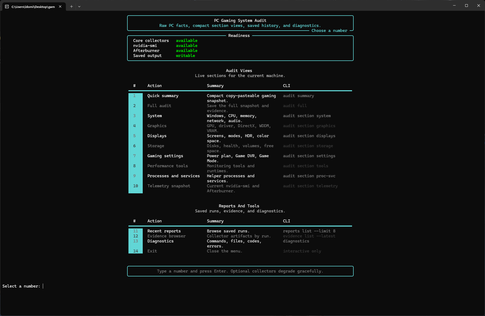
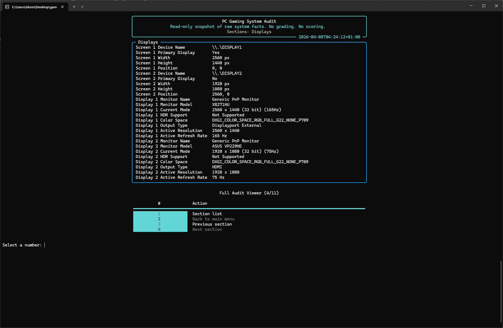
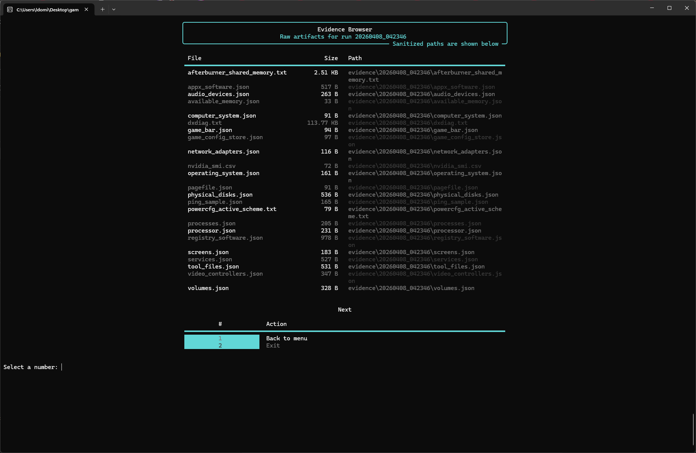

# PC Gaming System Audit

A privacy-aware Windows CLI that captures gaming-relevant system facts, telemetry, and per-run evidence.

This tool is read-only. It does not modify drivers, registry values, power plans, or game settings.

This tool collects and reports system context only. It does not apply optimizations or change configuration.

## What this demonstrates

- Rich CLI design (structured terminal UI)
- multi-source Windows system inspection
- normalized TXT and JSON reporting
- privacy-aware sanitization of saved output
- evidence-oriented diagnostics
- test-backed validation and iteration

## Design principles

- read-only by default
- collect only what is useful for gaming diagnostics
- sanitize saved outputs to reduce unnecessary exposure
- prefer structured, reproducible outputs over ad-hoc logs
- keep CLI interaction simple and explicit

## Why this exists

PC game setup and troubleshooting often start with the same repetitive questions:

- What hardware is this machine actually using?
- What display mode is active?
- Which drivers and monitoring tools are installed?
- Can the output be shared without exposing unnecessary identifiers?

AI-assisted tuning also works better when the machine context is structured instead of pasted from raw system dumps.

The goal is faster, safer context gathering - not automated decision-making.

## CLI Preview

### Menu



### Full Audit Section Viewer



### Evidence Browser



The repository preview assets are captured from the current Windows executable so the screenshots match the shipped interface.

## Installation

### Windows executable

Download `gaming-audit.exe` from the repo releases and run it on Windows 11.

Examples:

```powershell
.\gaming-audit.exe
.\gaming-audit.exe audit summary
.\gaming-audit.exe audit full
```

The executable uses the current working directory for `reports/`, `snapshots/`, and `evidence/`.

### Source install

```powershell
git clone https://github.com/OdinFenrir/gaming-audit-cli
cd gaming-audit-cli
python -m pip install -e .
```

### Build the Windows executable

```powershell
python -m pip install -e .[build]
powershell -ExecutionPolicy Bypass -File .\scripts\build_windows_exe.ps1
```

## Compatibility

- Windows 11 is the target platform
- Python 3.11+ is required only for source installs
- core audit collection works without NVIDIA or MSI Afterburner
- `nvidia-smi` telemetry is optional
- MSI Afterburner shared-memory telemetry is optional
- missing optional collectors are reported as unavailable rather than treated as fatal

## Quick Start

### Primary usage

Run the interactive menu:

```powershell
python run_audit.py
```

Run a compact summary:

```powershell
python run_audit.py audit summary
```

Run a full saved audit:

```powershell
python run_audit.py audit full
```

### Optional (installed entrypoint)

After an editable install:

```powershell
gaming-audit audit summary
gaming-audit audit full
```

## Example Commands

### Primary usage

```powershell
python run_audit.py audit summary
python run_audit.py audit full
python run_audit.py audit section system
python run_audit.py audit section graphics
python run_audit.py audit section displays
python run_audit.py audit section storage
python run_audit.py audit section settings
python run_audit.py audit section tools
python run_audit.py audit section proc-svc
python run_audit.py audit section telemetry
python run_audit.py reports list --limit 8
python run_audit.py reports latest --format txt
python run_audit.py evidence list --latest
python run_audit.py diagnostics
```

### Optional (installed entrypoint)

```powershell
gaming-audit audit summary
gaming-audit audit full
gaming-audit reports list --limit 8
```

## What it collects

- Windows version, build number, architecture, and last boot time
- CPU, RAM, and pagefile facts
- GPU, driver version, DirectX, and WDDM facts
- display models, active resolution, refresh rate, HDR support, and output type
- storage model, size, bus type, health status, and firmware version
- Game DVR, Game Mode, and power-plan facts
- performance tool inventory
- relevant helper process and service state
- live telemetry from `nvidia-smi`
- optional MSI Afterburner shared-memory telemetry
- saved report history and per-run evidence artifacts
- source diagnostics including command, return code, error text, and artifact path

Saved reports are sanitized by default.

## Default sanitization

Saved outputs intentionally remove or mask identifiers that are not needed for gaming diagnostics.

Redacted or masked values include:

- machine name
- MAC address
- disk serial numbers
- CPU processor ID
- volume GUID paths
- user-specific paths such as `C:\Users\[redacted]\...`
- software install paths
- process executable paths
- power-plan GUIDs such as `[redacted-guid]`
- DxDiag machine name and machine ID

Sanitization preserves diagnostic usefulness while removing common sources of system fingerprinting.

## Example compact summary

```text
PC Gaming Audit Summary
OS              : Windows 11 Home | Version 24H2 | Build 26200
CPU             : AMD Ryzen 7 5800X3D
GPU             : NVIDIA GeForce RTX 3070 | Driver 595.97
Primary Display : XB271HU | 2560 x 1440 | 165 Hz
RAM             : 31.91 GB
Power Plan      : Ultimate Performance
Game Mode       : Yes
Telemetry       : nvidia-smi, MSI Afterburner Shared Memory
GPU Temp        : 54
GPU Usage       : 12 %
Notes           : Optional telemetry may be limited on some systems
```

## Example sanitized output

```text
Overview
--------
CPU               : AMD Ryzen 7 5800X3D 8-Core Processor
GPU               : NVIDIA GeForce RTX 3070
Primary Display   : XB271HU | 2560 x 1440 | 165 Hz

Gaming Settings
---------------
Active Power Plan : Power Scheme GUID: [redacted-guid] (Ultimate Performance)

Metadata
--------
Project Root      : C:\Users\[redacted]\Desktop\gaming-audit-cli
```

## Limitations

- Windows-focused
- read-only by design
- telemetry depends on available tools such as `nvidia-smi` and MSI Afterburner
- not an optimizer or auto-config tool
- intended as a baseline/context tool, not a final tuning solution

## Tests

```powershell
python -m unittest tests.test_normalizers tests.test_services tests.test_reporters tests.test_rich_rendering -v
python -m compileall src tests
```

## Privacy and sharing

Saved reports are sanitized by default.

Evidence artifacts may still contain raw command output and should be reviewed before sharing.

Sanitization reduces exposure but does not guarantee anonymity.

The repository ignores generated runtime output by default:

- `reports/`
- `snapshots/`
- `evidence/`
- `build/`
- `dist/`

Recommended workflow:

- share sanitized TXT or JSON reports when you need machine context for debugging
- use `audit summary` for fast AI or support-chat context
- review evidence artifacts before sharing them
- keep local runtime outputs out of Git

## Screenshot policy

Windows PNG screenshots captured from the current executable are the canonical presentation assets.

## Architecture

See [docs/ARCHITECTURE.md](docs/ARCHITECTURE.md) for an engineering overview of the runtime pipeline, normalization, sanitization, and saved output flow.

For automation or AI-driven execution, see [AI_BOOTSTRAP.md](AI_BOOTSTRAP.md) for the exact full-diagnosis command flow and output locations.

## GitHub description

Privacy-aware Windows gaming audit CLI with sanitized reports, live telemetry, and evidence capture.
