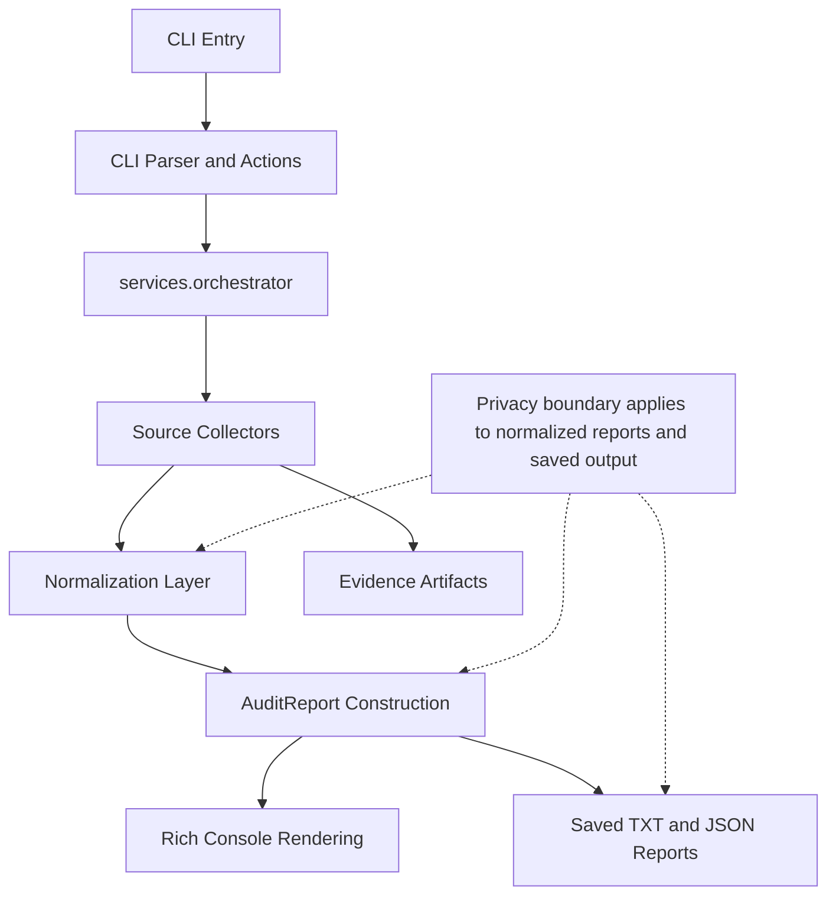

# Architecture Overview

This document describes the runtime architecture of the PC Gaming System Audit CLI.

It focuses on how data flows through the system: CLI entry, scope resolution, source collection, normalization, distributed sanitization, persistence, and rendering.

It is intended to help an engineer understand the system without reading the entire codebase.

## Purpose and Design Goals

The system is built around a small set of operational constraints:

- read-only by default
- collect gaming-relevant system context only
- produce structured, reproducible outputs
- preserve diagnostic value while reducing unnecessary exposure
- keep CLI interaction explicit and predictable

The tool is not an optimizer or auto-tuning system. It is a context collection and reporting pipeline.

## System Flow

At runtime, execution follows this path:

1. `run_audit.py` bootstraps the project root, adds `src/` to `sys.path`, and calls `gaming_audit.app.main`.
2. `gaming_audit.app.main` validates the runtime, checks for Rich, and hands control to the CLI layer.
3. CLI parsing resolves input into an `ActionRequest`.
4. Action definitions and scopes decide which operation or source set should run.
5. `services/orchestrator.py` coordinates collection, normalization, report construction, persistence, diagnostics, and saved-run access.
6. Reports are rendered for console output and, when applicable, written to disk.

## Core Subsystems

### CLI Layer

The CLI layer is responsible for command interpretation and presentation entry.

- `gaming_audit.app.main` configures the process and handles top-level error presentation.
- `cli.parser` converts raw arguments into an `ActionRequest`.
- `cli.actions` defines the menu items, command hints, and scope mapping used by both interactive and direct command flows.
- `cli.render` provides the Rich-based menu, report, saved-run, evidence, diagnostics, and full-audit section views.

The interactive menu keeps the numbered home screen as the main entry point. Inside that flow, `Full audit` opens a section-by-section viewer so the user can jump between sections or move forward and backward without relying on a single long terminal scroll.

### Orchestrator

`services/orchestrator.py` is the central coordinator of the application.

Its responsibilities include:

- mapping scopes to concrete source collectors
- creating runtime paths for persisted runs
- executing collectors and aggregating their snapshots
- materializing evidence artifacts when required
- building diagnostics records
- normalizing collected data into an `AuditReport`
- saving full-audit output and loading saved runs from disk

This is the main integration point where the application moves from raw collection into stable report generation.

### Source Collection

Each collector returns a `CollectedSource` containing:

- `data`: raw structured payloads for that source
- `evidence`: supporting command output, availability state, and artifact metadata

Current sources include WMI, network sampling, DxDiag, `nvidia-smi`, storage queries, registry reads, `powercfg`, software inventory, process inspection, service inspection, and MSI Afterburner shared-memory telemetry.

Scopes determine which source set runs for a given command. For example, `audit full` runs the complete source set, while section audits run only the collectors needed for that section.

Persisted runs prepare directories under:

- `reports/txt`
- `reports/json`
- `snapshots`
- `evidence/<run_stamp>`

Non-persisted flows may still allocate temporary evidence storage when a collector requires a file-based artifact, such as DxDiag output.

### Normalization Layer

`normalizers/records.py` is the boundary between raw source payloads and the stable report model.

It converts snapshots into normalized records such as:

- `MetricRecord`
- `SoftwareRecord`
- `ProcessRecord`
- `ServiceRecord`

Normalized sections are built from one or more source snapshots. For example, graphics and display sections combine WMI, DxDiag, and NVIDIA-derived data where available.

Unavailable collectors are surfaced intentionally through `Unavailable Metrics` rather than being silently dropped. This keeps failures visible in both diagnostics and saved output.

### Reporting and Saved Output

The normalized `AuditReport` is the main output model.

- text reports are produced by the console-style reporter
- JSON reports serialize the normalized `AuditReport`
- saved report browsing loads from disk rather than recollecting the machine state

Saved metadata is part of the report payload itself. It includes values such as generation time, run stamp, scope, and sanitized output locations.

## Privacy and Sanitization

Sanitization is distributed across the pipeline rather than implemented as one isolated post-processing stage.

### Where it happens

- source-level redaction removes or masks certain identifiers before they become normalized output
- normalization and formatting sanitize string values before they are stored in shareable report fields
- evidence artifact path materialization sanitizes persisted artifact paths
- report metadata construction sanitizes project and output paths written into saved reports

### Current behavior

The current implementation removes or redacts values such as:

- machine name
- MAC address
- disk serial numbers
- CPU processor ID
- volume GUID paths
- DxDiag machine name and machine ID

It also masks or omits values such as:

- user paths, for example `C:\Users\[redacted]\...`
- power plan GUIDs, for example `[redacted-guid]`
- software install paths
- process executable paths

The goal is to preserve diagnostic usefulness while removing common sources of system fingerprinting.

### Evidence handling

Evidence artifacts are useful for diagnostics, but they are closer to raw collector output than the normalized reports.

Evidence may still include raw command output and should be reviewed before sharing.

## Runtime Outputs

When persistence is enabled, the application produces:

- `reports/txt/system_audit_<run_stamp>.txt`
- `reports/json/system_audit_<run_stamp>.json`
- `snapshots/latest.json`
- `evidence/<run_stamp>/...`

These paths are created through `utils.paths.prepare_runtime_paths` and then written by the orchestrator/reporting layer.

## System Flow Diagram

## Change Safely

When adding a new source:

- register it in scope wiring
- decide whether it needs persisted or temporary evidence handling
- normalize its output into existing or new report sections
- expose failure state through diagnostics or unavailable metrics
- add or update tests that cover the new collector and output shape

When adding new output fields:

- evaluate privacy impact before exposing the field in saved artifacts
- apply sanitization where needed
- avoid leaking identifiers into report metadata, evidence paths, or normalized output
- preserve the read-only contract

## Summary

The system is a structured pipeline:

collect -> normalize -> sanitize -> report -> persist

Its architecture prioritizes reproducibility, explicit data flow, and controlled exposure of system information.

It is intentionally not an optimization system. It is a context collection and reporting system.

